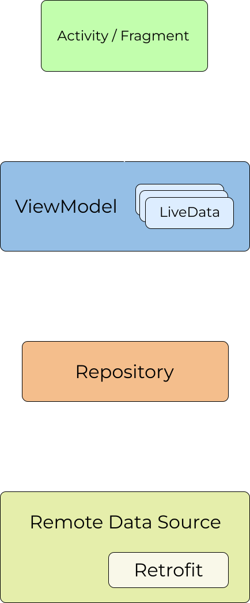

<div align="center">
<br>


</div>

<h1 align = "center">DroidJobs</h1>
DroidJobs is your go-to Android app for effortlessly browsing the latest job openings tailored for Android developers. Powered by the comprehensive API from <a href="https://androiddev.careers/">androiddev.careers</a>, DroidJobs presents streamlined listings enriched with essential details like job descriptions, salaries, and more. Built with a focus on convenience, DroidJobs is designed for developers by a developer, making the job search journey smoother and more productive. Whether you're a seasoned professional or just starting your Android development journey, DroidJobs is here to help you find the perfect opportunity. Dive in and explore the world of Android development careers with ease!

## Developed Using 🛠

- [Kotlin](https://developer.android.com/kotlin/first) - First class and official programming language for Android development.
- [Coroutines](https://kotlinlang.org/docs/coroutines-overview.html) - For asynchronous calls and tasks to utilize threads.
- [Jetpack Navigation](https://developer.android.com/guide/navigation) - A powerful navigation component provided by Android Jetpack, facilitating seamless navigation between destinations in your app's user interface.
- [Retrofit](https://square.github.io/retrofit/) - A type-safe HTTP client for Android, used for making network requests and interacting with RESTful APIs.
- [OkHttp](https://square.github.io/okhttp/) - Leverage OkHttp's flexible configuration options to set custom connection and read timeouts, effectively managing network operations and mitigating Socket Timeout Exception occurrences.
- [Hilt](https://developer.android.com/training/dependency-injection/hilt-android) - Jetpack's recommended dependency injection library, simplifying the process of providing dependencies throughout your app.
- [Android Architecture Components](https://developer.android.com/topic/architecture) - Collection of libraries that help us design testable, and maintainable apps.
  - [ViewModel](https://developer.android.com/topic/libraries/architecture/viewmodel) - Stores UI-related data that isn't destroyed on UI changes.
  - [LiveData](https://developer.android.com/topic/libraries/architecture/livedata) - LiveData was used to save and store values for ViewModel calls and response to method calls.
- [Coil](https://coil-kt.github.io/coil/compose/) - To set or place URL as Images as the icon.

## Architecture 👷‍♂️
This application was developed following the [MVVM(Model View View-Model)](https://developer.android.com/topic/architecture#recommended-app-arch) architecture.
<br>
<div align="center">
<br>

</div>

## Screenshots 📱
<p align="center">  
    
     
</p> 

## Video 📽
<p align = "center">
  

https://github.com/GeekLord04/DroidJobs/assets/84928799/4c40b400-e663-43b3-bb9f-f2645bf72a1a

</p>

## Connect with me:
[](https://github.com/GeekLord04/)
[](https://www.linkedin.com/in/chirag-cy/)
[](https://twitter.com/GeekLord04)

## License 📜
```
MIT License

Copyright (c) 2024 Chirag Chakraborty

Permission is hereby granted, free of charge, to any person obtaining a copy
of this software and associated documentation files (the "Software"), to deal
in the Software without restriction, including without limitation the rights
to use, copy, modify, merge, publish, distribute, sublicense, and/or sell
copies of the Software, and to permit persons to whom the Software is
furnished to do so, subject to the following conditions:

The above copyright notice and this permission notice shall be included in all
copies or substantial portions of the Software.

THE SOFTWARE IS PROVIDED "AS IS", WITHOUT WARRANTY OF ANY KIND, EXPRESS OR
IMPLIED, INCLUDING BUT NOT LIMITED TO THE WARRANTIES OF MERCHANTABILITY,
FITNESS FOR A PARTICULAR PURPOSE AND NONINFRINGEMENT. IN NO EVENT SHALL THE
AUTHORS OR COPYRIGHT HOLDERS BE LIABLE FOR ANY CLAIM, DAMAGES OR OTHER
LIABILITY, WHETHER IN AN ACTION OF CONTRACT, TORT OR OTHERWISE, ARISING FROM,
OUT OF OR IN CONNECTION WITH THE SOFTWARE OR THE USE OR OTHER DEALINGS IN THE
SOFTWARE.
```

I highly welcome your contributions, feedback, and suggestions! 🌟 Feel free to share with anyone who can benefit, and if it helps you, please give it a star 🌟.

[](https://forthebadge.com)
[](https://forthebadge.com)
[](https://forthebadge.com)
[](https://forthebadge.com)
